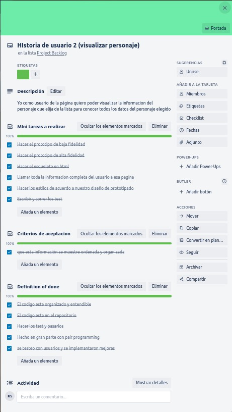

# Data Lovers Rickcionary

## Índice

* [1. Informacion del proyecto](#1-informacion del proyecto)
* [2. Captura del proyecto final](#2-captura del proyecto final)
* [3. Objetivos de aprendizaje](#3-objetivos-de-aprendizaje)
* [4. Consideraciones generales](#4-consideraciones-generales)
* [5. Criterios de aceptación mínimos del proyecto](#5-criterios-de-aceptación-mínimos-del-proyecto)
* [6. Hacker edition](#6-hacker-edition)
* [7. Consideraciones técnicas](#7-consideraciones-técnicas)
* [8. Pistas, tips y lecturas complementarias](#8-pistas-tips-y-lecturas-complementarias)
* [9. Checklist](#9-checklist)

***

## 1. Definicion del producto

Nuestro proyecto muestra todos los personajes de la serie Rick y Morty, 
y permite al usuario interarctuar con la aplicacion web. En la misma
se puede buscar un personaje en específico si se sabe el nombre completo, 
o se puede filtrar a partir de diferentes caracteristicas, y ordenar los 
personajes que aparecen en pantalla

## 2. Historias de usuario

## 2. Captura del proyecto final

## 3. Prototipo de alta de fidelidad

## 3. Link a Zeplin

## 4. Prototipo de baja fidelidad

## 5. Resultados de test de usabilidad

A cada usuario se le asigno una tarea de filtrado y ordenado en especifico, 
por ejempl, filtrar por origen y ordenarlo en orden alfabetico. Todos los 
usuarios manifestaron que fue muy sencillo encontrara la ruta para completar
la tarea solicitada. Solo se hicieron pequeños cambios de diseño despues de la 
iteración que no estaban relacionados con la funcionalidad de la aplicacion pero 
que mejoraban su experiencia de usuario.

## 6. Indicadores

## 7. Checklist

* [ * ] Usa VanillaJS.
* [ * ] Pasa linter (`npm run pretest`)
* [ * ] Pasa tests (`npm test`)
* [ * ] Pruebas unitarias cubren un mínimo del 70% de statements, functions y
  lines y branches.
* [ * ] Incluye _Definición del producto_ clara e informativa en `README.md`.
* [ * ] Incluye historias de usuario en `README.md`.
* [ * ] Incluye _sketch_ de la solución (prototipo de baja fidelidad) en
  `README.md`.
* [ * ] Incluye _Diseño de la Interfaz de Usuario_ (prototipo de alta fidelidad)
  en `README.md`.
* [ * ] Incluye link a Zeplin en `README.md`.
* [ * ] Incluye el listado de problemas que detectaste a través de tests de
  usabilidad en el `README.md`.
* [ * ] UI: Muestra lista y/o tabla con datos y/o indicadores.
* [ * ] UI: Permite ordenar data por uno o más campos (asc y desc).
* [ * ] UI: Permite filtrar data en base a una condición.
* [ * ] UI: Es _responsive_.
